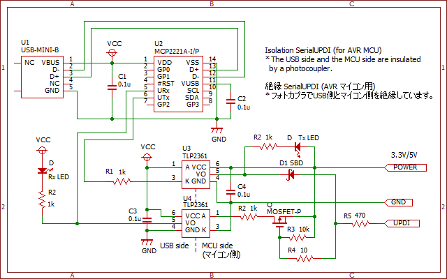
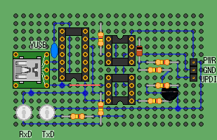
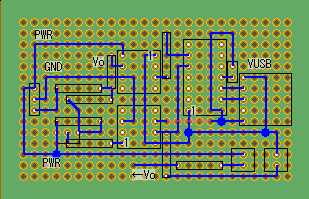

# Isolation-Serial-UPDI-Adapter

ATtiny202 などの新しい AVR マイコンでは、UPDI と呼ばれるプログラミング・デバッグインターフェースが採用されています。  
このリポジトリでは、PC から UPDI を絶縁して利用するためのアダプタ回路を紹介しています。

シリアル通信 IC に MCP2221A を使用しており、Windows や Linux においてドライバインストールなしで利用できます。

元々、ATtiny202 を絶縁状態でプログラム書き込みする必要があり設計したのですが、製作する必要がなくなってしまいました。そのため、動作確認できていません。

参考サイト
* ikkei blog - USB to UPDI
  * https://blog.goo.ne.jp/jh3kxm/e/9bf429adc58bc09dc164e5ef30397f1f
* GitHub - AVR-Guidance/UPDI/jtag2updi.md
  * https://github.com/SpenceKonde/AVR-Guidance/blob/master/UPDI/jtag2updi.md

## Circuit design 回路設計 

作図ソフトウェアは BSch3V です。

実際に製作していないので分からないのですが、Pch MOS-FET は不要かもしれません。  
不具合があった場合は、U4 の Anode 端子は、電流制限抵抗を介して D1 と R5 へ接続してください。参考サイトの回路の通りになります。

* BSch3V - https://www.suigyodo.com/online/schsoft.htm

## Board design 基板設計

ユニバーサル基板（秋月電子通商 C 基板）で製作できます。  
作図ソフトウェアは marmelo です。

* marmelo - https://motchy99.blog.fc2.com/blog-entry-70.html

## 主要な部品リスト
ほとんどの部品は秋月電子通商から購入することができます。  
特記事項なしは 1/4W 炭素被膜抵抗などの汎用品です。

### 基板その他
製作例では USB Mini ケーブルを接続していますが、お好みで変更できます。

* 秋月電子通商 ユニバーサル基板 C タイプ
  * https://akizukidenshi.com/catalog/g/g103229
* USBケーブル USB2.0 Type-Aオス⇔ミニBオス 1.5m A-miniB
  * https://akizukidenshi.com/catalog/g/g117014/
* 秋月電子通商 ブレッドボード用ミニBメスUSBコネクターDIP化キット
  * https://akizukidenshi.com/catalog/g/g105258/

### SerialUPDI
シリアル変換に MCP2221A を利用していますが、その他の IC やモジュールを利用できます。

* USB⇔シリアル変換IC MCP2221A-I/P
  * https://akizukidenshi.com/catalog/g/g113069/
* フォトカプラー GaAlAs赤外LED+フォトIC TLP2361  2個
  * https://akizukidenshi.com/catalog/g/g111004/
* D1 SBD ショットキーバリアダイオード
  * 信号用
* MOSFET Pch
  * 信号用 エンハンスドタイプ
